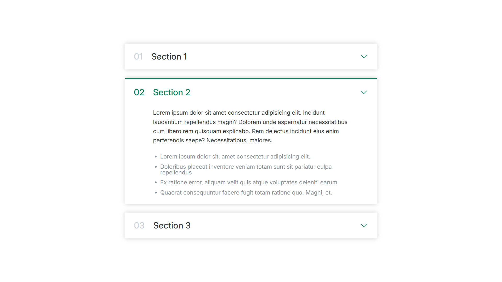

## Accordion Component

Simple accordion UI component using **HTML and CSS**.

## Features
- Active state styling using `.active` class
- Nested selectors for state-based UI changes
- Clean and reusable structure
- Fully built with **HTML** & **CSS**

## What I Learned
- How to use **state classes** like `.active` to control UI behavior
- How descendant selectors work (`.active .text`)
- Structuring accordion components using semantic HTML
- Basic UI component structures

## Key Concepts
The active class acts as a "state controller":
```css
.active .number,
.active .text {
color: var(--main-color);
}
```

## Preview

