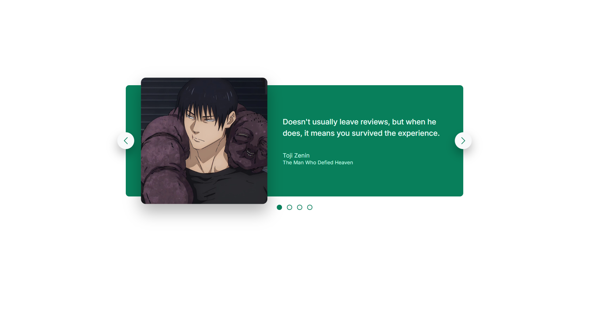

# Carousel Component
Simple carousel component using **HTML** and **CSS**.

## Features
- Buttons positioned using `absolute` positioning
- Centered icons using `transform: translate()`
- Image scaled using `transform: scale`
- Clean and reusable structure
- Fully built with **HTML** and **CSS**

## What I Learned
- Use of `position: absolute` for floating UI elements
- How `transform: translate()` helps with precise element centering
- How `transform: scale()` works
- How powerful Flexbox is for alignment and spacing
- Structuring and resuable UI components

## Key Concepts
Absolute positioning allows elements to be plced independently inside a parent container:
```
.btn{
  position: absolute;
}

.btn--left{
  left: 0;
  top: 50%;
  transform: translate(-50%, -50%);
}

.btn--right{
  right: 0;
  top: 50%;
  transform: translate(50%, -50%);
}
```

## Preview

