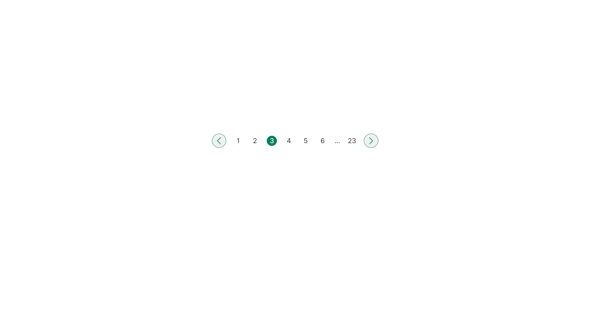

# Pagination Component
Simple pagination component using **HTML** and **CSS**.

## Features
- Numbered page buttons
- Previous and Next navigation buttons
- Hover effects for buttons, links and icons
- Clean and resuable component structure

## What I Learned
- Building a pagination layout using Flexbox
- Styling buttons and SVG icons
- Creating hover effects using pseudo-classes
- Changing child element styles based on a parent hover state (e.g.`.btn:hover .btn-icon`)
- Improving component structure and spacing

## Preview

