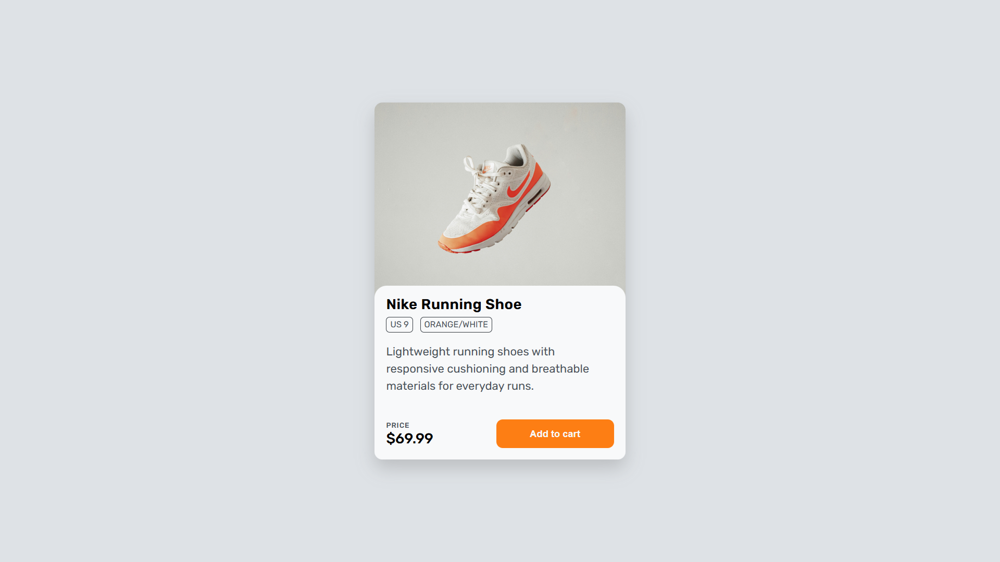

# Product Card Layout
A simple product card UI built using **HTML** and **CSS**

## Features
- Product image and information layout
- Price and product details section
- Hover effects for buttons
- Clean and reusable component structure

## What I Learned
- Using Flexbox for alignment and layout
- Positioning elements with `position:absolute;` to create overlays
- Creating overlapping sections using negative margins
- Using `overflow:hidden` to maintain border radius in child elements
- Understanding how `z-index` controls the stacking order of elements

## Preview

